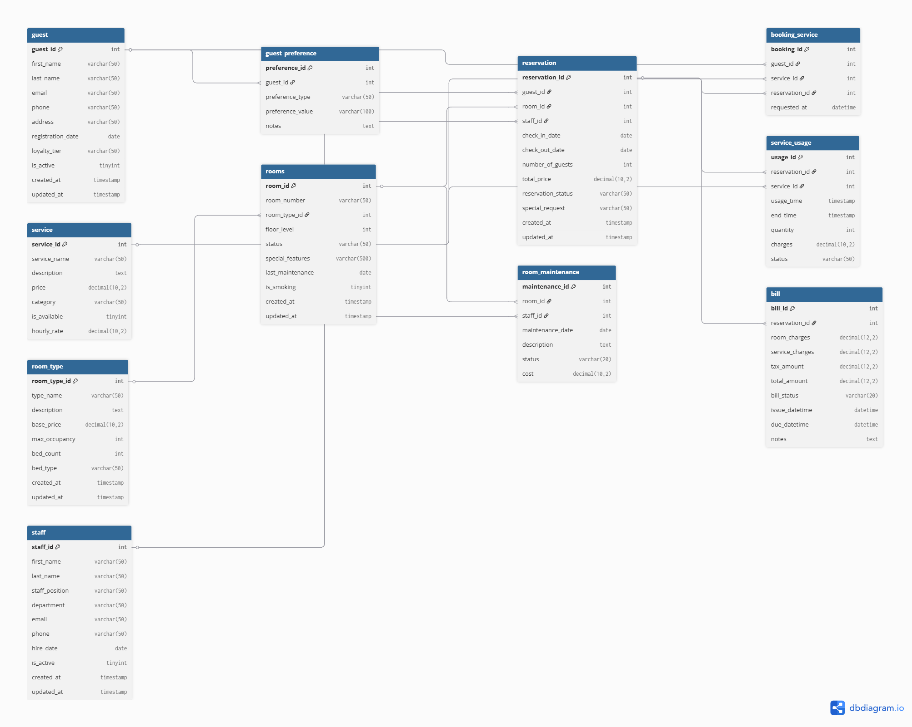

# Hotel Management Database System

A fully structured relational database system for managing hotel operations, built using **MySQL**.  
This project demonstrates database design, normalization, stored procedures, triggers, and analytical queries in a real-world hospitality scenario.

---

## 📌 Project Overview

This database system manages:

- Guest registration and preferences  
- Room and room type management  
- Reservations and bookings  
- Hotel services and service usage tracking  
- Billing and payments  
- Staff management  
- Automated charge calculations via triggers  
- Analytical reporting queries  

The project follows professional database organization and modular SQL structure.

---

## 📊 Entity Relationship Diagram (ERD)

The visual schema of the Hotel Management Database:

🔗 **Interactive ERD:**  
👉 https://dbdiagram.io/d/69a16b8aa3f0aa31e14ad53e

## 🖼️ ERD Preview

✅ The interactive diagram allows zooming, table inspection, and relationship tracing.

---

## Project Structure

hotel-management-db/
│
├── schema/
│ └── schema.sql
│
├── data/
│ └── sample_data.sql
│
├── procedures/
│ └── hotel_reservation_procedures.sql
│
├── triggers/
│ └── hotel_triggers.sql
│
├── analytics/
│ └── hotel_db_analytics.sql
│
└── README.md

---

## Folder Descriptions

- **schema/** → Database and table creation scripts  
- **data/** → Sample dataset for testing  
- **procedures/** → Stored procedures for reservations, billing, and services  
- **triggers/** → Automated business logic triggers  
- **analytics/** → Reporting and analytical SQL queries  

---

## 🛠️ Technologies Used

- MySQL  
- SQL (DDL, DML, Stored Procedures, Triggers)  
- Relational Database Design (3NF normalization)  

---

## Installation & Setup
### Step 1 — Create the Database Schema

Run:

SOURCE schema/schema.sql;

This creates the database and all tables.

### Step 2 — Insert Sample Data

Run:

SOURCE data/sample_data.sql;

This loads test data into the database.

### Step 3 — Load Stored Procedures

Run:

SOURCE procedures/hotel_reservation_procedures.sql;

### Step 4 — Load Triggers

Run:

SOURCE triggers/hotel_triggers.sql;

### Step 5 — Run Analytics (Optional)

Run:

SOURCE analytics/hotel_db_analytics.sql;

-----------------------------------------------------

## Key Features
### Reservation Management

. Create and update reservations

. Handle guest preferences automatically

### Service Booking System

. Book and cancel hotel services

. Track service usage duration

### Automated Billing

. Trigger-based charge calculation

. Dynamic bill updates when services complete

### Stored Procedures

. Includes procedures for:

. Reservation handling

. Service booking

. Billing generation

. Payment processing

### Triggers

. Auto-calculates service charges

. Automatically updates bills

---

## Database Design

> The schema follows:

. Third Normal Form (3NF)

. Foreign key constraints

. InnoDB storage engine

. Referential integrity enforcement

> Core entities include:

. Guests

. Reservations

. Rooms

. Services

. Billing

. Staff

. Service Usage

-----------------------------------------------------------

## Testing the System

Example test queries:

CALL GenerateBill(1);
CALL BookService(1, 2, 1);
SELECT * FROM reservation;
SELECT * FROM bill;

-------------------------------------------------------------

## Learning Objectives

> This project demonstrates:

. Relational schema design

. SQL modularization

. Stored procedure logic

. Trigger automation

. Data integrity management

. Real-world database architecture

-------------------------------------------------------------

## Author

Denzel Okoro
Hotel Management Database Project
Portfolio demonstration of SQL and database engineering skills.

-------------------------------------------------------------

## License

This project is for educational, portfolio, and professional purposes.